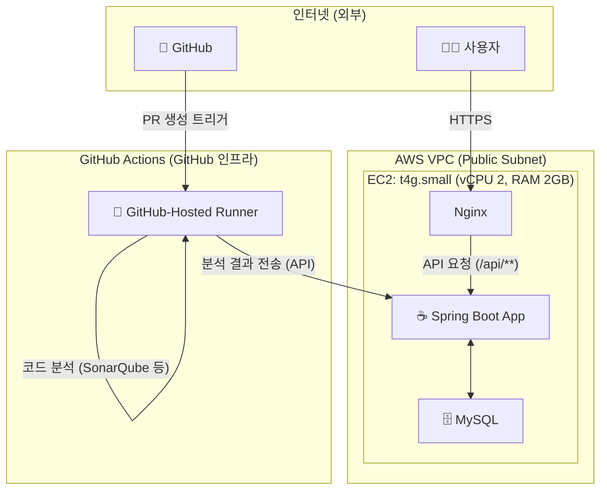

# 🤖 Code Review Helper: AI 기반 주니어 개발자 코드리뷰 보조 플랫폼

**"더 이상 혼자 고민하지 마세요. AI 동료가 당신의 성장을 돕습니다."**

Code Review Helper는 주니어 개발자들이 코드 리뷰 과정에서 겪는 어려움을 해결하고, 성장을 촉진하기 위해 만들어진 AI 기반 코드리뷰 보조 플랫폼입니다. Pull Request(PR)가 생성되면, AI와 정적 분석 도구가 자동으로 코드를 분석하여 리뷰어가 놓칠 수 있는 부분이나 개선점을 '가이드' 형태로 제공합니다.

---

##  목차

- [1. 프로젝트 개요](#1-프로젝트-개요)
- [2. 주요 기능](#2-주요-기능)
- [3. 아키텍처](#3-아키텍처)
- [4. 기술 스택](#4-기술-스택)
- [5. 동작 플로우](#5-동작-플로우)

---

## 1. 프로젝트 개요

### 배경

주니어 개발자는 종종 다음과 같은 어려움을 겪습니다.
- **리뷰 요청의 막막함:** 어떤 부분을 중점적으로 봐달라고 요청해야 할지, 내 코드에 어떤 잠재적 문제가 있는지 알기 어렵습니다.
- **리뷰어의 부담:** 시니어 리뷰어는 기본적인 코딩 컨벤션이나 간단한 버그를 지적하는 데 많은 시간을 소모하게 되어, 정작 중요한 아키텍처나 로직 리뷰에 집중하기 어렵습니다.
- **성장의 한계:** 리뷰를 통해 성장하고 싶지만, 일관성 있는 피드백을 받기 어렵고 리뷰어의 스타일에 따라 리뷰 품질이 달라질 수 있습니다.

### 목표

본 플랫폼은 이러한 문제들을 해결하여 다음과 같은 가치를 제공하는 것을 목표로 합니다.
- **주니어 개발자에게:** AI가 제공하는 '사전 분석 리포트'를 통해 자신의 코드를 객관적으로 돌아볼 기회를 제공하고, 시니어에게 더 수준 높은 질문을 할 수 있도록 돕습니다.
- **시니어 리뷰어에게:** 반복적이고 기본적인 피드백은 AI에게 맡기고, 더 중요한 설계 및 로직 리뷰에 집중하여 팀의 생산성을 높입니다.
- **개발팀 전체에:** 일관된 코드 품질 기준을 유지하고, 건강한 코드 리뷰 문화를 정착시켜 팀 전체의 기술적 성장을 촉진합니다.

---

## 2. 주요 기능

* **GitHub 연동 및 자동 분석**
  - GitHub 계정으로 간편하게 로그인하고, 분석을 원하는 저장소를 등록합니다.
  - 저장소에 새로운 Pull Request가 생성되면, 자동으로 분석을 시작합니다.

* **AI 기반 인텔리전트 분석**
  - PR의 제목, 본문, 코드 변경 내용을 종합하여 **개발자의 숨은 의도를 추론**하고 요약합니다.
  - 잠재적인 논리적 오류, 성능 저하 가능성, 예외 처리 누락 등 **사이드 이펙트를 예측**하여 알려줍니다.

* **정적 분석 리포트**
  - SonarQube 스캐너를 활용하여 코딩 컨벤션 위반, 보안 취약점, 코드 스멜(나쁜 습관) 등을 찾아냅니다.

* **리뷰어 보조 인터페이스**
  - 분석 결과를 '참고 자료'로 제공하여, 리뷰어가 더 넓은 시야로 코드를 검토할 수 있도록 돕습니다.
  - 사용자는 분석 리포트를 참고하여, 원하는 코드 라인에 자신의 이름으로 직접 리뷰 코멘트를 작성하고 게시할 수 있습니다.

---

## 3. 아키텍처

본 프로젝트는 비용과 관리 효율성을 극대화하기 위해 **단일 EC2 인스턴스**와 **GitHub Actions**를 조합한 초경량 서버리스 아키텍처를 채택했습니다.

* **EC2 서버 (t4g.small):** 오직 사용자 요청을 처리하는 API 서버와 웹서버 역할만 수행하여 리소스 사용을 최소화합니다.
* **GitHub Actions:** 가장 무거운 작업인 코드 분석(SonarQube) 및 AI 추론을 GitHub의 인프라 위에서 실행합니다. 분석이 완료되면, 그 결과만 API를 통해 우리 EC2 서버로 전달합니다.
* **Nginx:** 리버스 프록시 및 React 정적 파일 서빙을 담당합니다.
* **Spring Boot:** 핵심 비즈니스 로직 및 API를 담당합니다.
* **MySQL:** 사용자, 저장소, 분석 리포트 등의 데이터를 저장합니다.

---

## 4. 기술 스택

| 구분 | 기술 스택 | 비고 |
| :--- | :--- | :--- |
| **Frontend** | React, TypeScript, Axios, Zustand | 사용자 인터페이스 구축 |
| **Backend** | Spring Boot, Java 17, Spring Data JPA, Spring Security | 비즈니스 로직 및 API 서버 |
| **Database** | MySQL | 데이터 영구 저장 |
| **CI/CD & Analysis** | GitHub Actions | 코드 분석, 빌드, 배포 자동화 |
| **Infra** | AWS EC2 (t4g.small), Nginx, Docker, Docker Compose | 서버 인프라 구축 및 컨테이너 관리 |
| **Analysis Tools**| SonarQube Scanner, OpenAI API (GPT-4) | 코드 정적 분석 및 AI 추론 |

---

## 5. 동작 플로우

1.  **설정:** 사용자가 서비스에 GitHub으로 로그인하고, 분석을 원하는 저장소에 GitHub App을 설치합니다.
2.  **PR 생성:** 개발자가 GitHub에 새로운 PR을 생성합니다.
3.  **자동 분석 (on GitHub Actions):** PR 생성 이벤트를 트리거로, GitHub Actions 워크플로우가 실행됩니다. 이 워크플로우는 SonarQube 스캐너와 AI 분석 스크립트를 실행합니다.
4.  **결과 전송:** 분석이 완료되면, GitHub Actions는 분석 결과 데이터를 우리 서비스의 API 엔드포인트로 전송합니다.
5.  **리포트 확인:** 리뷰어는 우리 서비스 대시보드에서 분석이 완료된 PR의 '분석 리포트'를 확인합니다.
6.  **리뷰 작성 및 게시:** 리뷰어는 리포트를 참고하여 GitHub 코드 위에 자신의 코멘트를 직접 작성하고, '게시' 버튼을 눌러 자신의 이름으로 리뷰를 최종 등록합니다.
